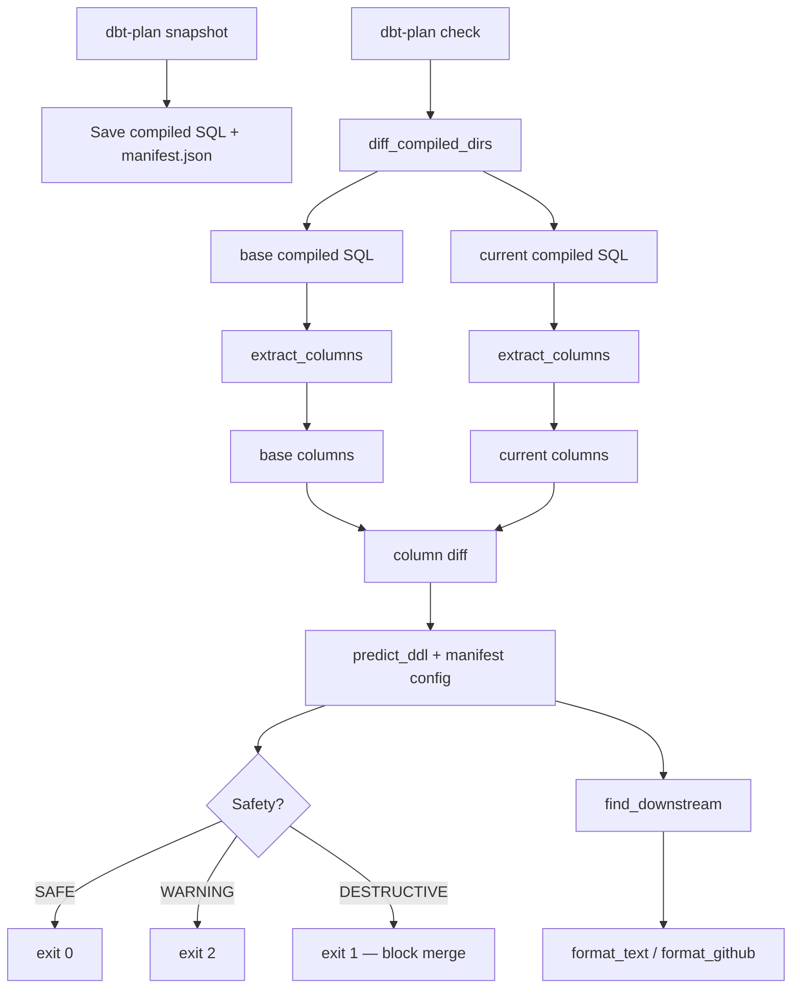

# dbt-plan

Static analysis tool that warns about risky DDL changes before `dbt run`.

Like `terraform plan` for dbt. No warehouse connection needed. Works with any warehouse (Snowflake, BigQuery, Redshift, Postgres, etc.).

## What It Does

dbt-plan analyzes compiled SQL diffs to catch dangerous schema changes at PR time:

- **Column changes**: detects ADD/DROP COLUMN from SQL diff
- **Risk assessment**: judges safety based on materialization x on_schema_change rules
- **Cascade analysis**: finds downstream models that reference dropped columns
- **Config changes**: detects materialization or on_schema_change policy changes

It does NOT execute anything, connect to any warehouse, or simulate `dbt run`. It reads files, compares them, and warns you.

## Quick Start

```bash
pip install dbt-plan

# In your dbt project directory:
dbt-plan run               # One command: compile baseline → compile current → check
```

That's it. `dbt-plan run` handles `dbt compile`, snapshotting, and checking automatically.

### More commands

```bash
dbt-plan init              # Generate .dbt-plan.yml config + update .gitignore
dbt-plan stats             # Analyze project readiness
dbt-plan ci-setup          # Generate GitHub Actions workflow
dbt-plan check --format github   # GitHub markdown output
dbt-plan check --format json     # JSON for CI pipelines
dbt-plan check --select model1   # Check specific model only
```

## Output Example

```
$ dbt-plan check

dbt-plan -- 2 model(s) changed

DESTRUCTIVE  int_unified (incremental, sync_all_columns)
  DROP COLUMN  data__device
  DROP COLUMN  data__user
  ADD COLUMN   data__device__uuid
  Downstream: dim_device, fct_events (2 model(s))
  >> BROKEN_REF  fct_events: references dropped column(s): data__device

SAFE  dim_device (table)
  CREATE OR REPLACE TABLE

dbt-plan: 2 checked, 1 safe, 0 warning, 1 destructive, 1 cascade risk(s)
```

## What Works (v0.3.3)

| Feature | Status | Details |
|---------|--------|---------|
| Column extraction (SQLGlot) | **Done** | Multi-dialect (Snowflake, BigQuery, Postgres, etc.) |
| DDL prediction | **Done** | All materialization x on_schema_change combinations |
| Downstream impact | **Done** | Memoized batch BFS, cycle protection |
| Cascade impact analysis | **Done** | Broken column refs, build failures in downstream models |
| Config change detection | **Done** | Materialization and on_schema_change policy changes |
| Removed model detection | **Done** | Always DESTRUCTIVE (ephemeral = SAFE) |
| Parse failure safety | **Done** | Never returns SAFE when columns unknown |
| Duplicate column safety | **Done** | Ambiguous columns trigger REVIEW REQUIRED |
| SELECT * fallback | **Done** | Manifest column definitions as fallback |
| Output formats | **Done** | `--format text` (color) / `github` / `json` |
| Configuration | **Done** | `.dbt-plan.yml` + env vars (`DBT_PLAN_*`) + `compile_command` |
| Commands | **Done** | `snapshot`, `check`, `init`, `stats`, `run`, `ci-setup` |
| One-command check | **Done** | `dbt-plan run` — compile + snapshot + check in one step |
| CI setup | **Done** | `dbt-plan ci-setup` — generates GitHub Actions workflow |
| Model filtering | **Done** | `--select model1,model2` / `ignore_models` in config |
| Package filtering | **Done** | Auto-excludes dbt package models |
| CI integration | **Done** | 209 tests, 93% coverage, CI workflow template |
| Verbose mode | **Done** | `--verbose` / `-v` for debugging |

## Scope

dbt-plan is a **static analysis warning tool**, not a runtime simulator.

| In scope | Out of scope |
|----------|-------------|
| Column ADD/DROP detection from compiled SQL | `dbt run` simulation |
| materialization × on_schema_change risk rules | Warehouse connection |
| Cascade broken ref / build failure analysis | `seed` / `source` change detection |
| Config change detection (materialization, osc) | `pre_hook` / `post_hook` DDL analysis |
| CI exit codes + structured output | `full_refresh` mode judgment |

**Design principle**: false warnings are OK, false safe is never OK.

## Future Improvements

| Feature | Why It Matters |
|---------|----------------|
| `ddl-reviewed` label override | Escape hatch for intentional destructive changes |
| INFORMATION_SCHEMA query | For SELECT * models without manifest column definitions |
| Column type detection | `ALTER TYPE` predictions |

## DDL Prediction Rules

| Materialization | on_schema_change | Predicted DDL | Safety |
|-----------------|------------------|---------------|--------|
| table | any | `CREATE OR REPLACE TABLE` | SAFE |
| view | any | `CREATE OR REPLACE VIEW` | SAFE |
| incremental | ignore | no DDL | SAFE |
| incremental | fail | build failure | WARNING |
| incremental | append_new_columns | `ADD COLUMN` only | SAFE |
| incremental | sync_all_columns | `ADD + DROP COLUMN` | DESTRUCTIVE if columns removed |
| any | (model removed) | `MODEL REMOVED` | DESTRUCTIVE |

## CI Integration (GitHub Actions)

```yaml
name: dbt-plan
on:
  pull_request:
    paths: ['models/**', 'macros/**']

jobs:
  plan:
    runs-on: ubuntu-latest
    steps:
      - uses: actions/checkout@v4
        with: { fetch-depth: 0 }

      - run: pip install uv && uv sync
      - run: pip install dbt-plan  # or: pip install git+https://github.com/ab180/dbt-plan@v0.2.0

      # Compile and snapshot base branch
      - run: |
          git checkout ${{ github.event.pull_request.base.sha }}
          dbt compile
          dbt-plan snapshot

      # Compile current and check
      - run: |
          git checkout ${{ github.event.pull_request.head.sha }}
          dbt compile
          dbt-plan check --format github >> $GITHUB_STEP_SUMMARY

      # Block destructive changes (exit 1)
      - run: dbt-plan check
```

## How It Works



## Contributing

See [CONTRIBUTING.md](CONTRIBUTING.md) for development setup, TDD workflow, and coding rules.

### Architecture

```
src/dbt_plan/
├── columns.py      # SQLGlot column extraction (multi-dialect)
├── config.py       # .dbt-plan.yml + env var configuration
├── predictor.py    # DDL risk assessment rules + cascade analysis
├── manifest.py     # manifest.json parsing + downstream BFS
├── diff.py         # compiled SQL directory comparison
├── formatter.py    # text / GitHub markdown / JSON output
└── cli.py          # CLI: snapshot, check, init, stats, run, ci-setup
```

### How to Contribute

**Good first issues:**
- Add compiled SQL fixtures in `tests/fixtures/` for edge cases (UNION, subqueries, etc.)
- Improve error messages for common mistakes

**Medium issues:**
- `ddl-reviewed` label override — escape hatch for intentional destructive changes
- INFORMATION_SCHEMA integration — query warehouse for SELECT * resolution

**Design decisions:** See [docs/architecture-decisions.md](docs/architecture-decisions.md).

## Supported

- dbt-core 1.7+
- Any warehouse: Snowflake, BigQuery, Redshift, Postgres, DuckDB, etc. (`--dialect`)
- Python 3.10+
- CTE, UNION ALL, QUALIFY, window functions, VARIANT access

## License

Apache-2.0
