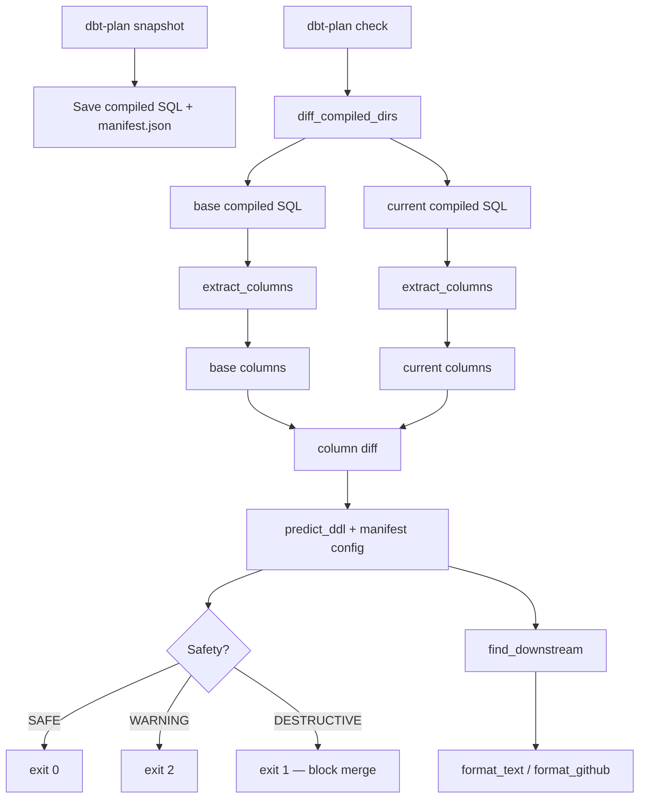

# dbt-plan

Preview what DDL changes `dbt run` will execute — before you run it.

Like `terraform plan` for dbt. Works with major warehouses supported by dbt (Snowflake, BigQuery, Redshift, Postgres, etc.).

## Goal

Catch destructive DDL changes (like `DROP COLUMN`) before they reach production. dbt's `incremental` + `sync_all_columns` can silently execute `ALTER TABLE` when SELECT columns change. dbt-plan detects this at PR time and blocks the merge.

## Quick Start

```bash
pip install git+https://github.com/ab180/dbt-plan@v0.2.0

# In your dbt project directory:
dbt-plan init              # Generate .dbt-plan.yml config + update .gitignore
dbt-plan stats             # Analyze project readiness

dbt compile
dbt-plan snapshot          # Save baseline (compiled SQL + manifest)
# ... make model changes ...
dbt compile
dbt-plan check             # See what will change
dbt-plan check --format github   # GitHub markdown output
dbt-plan check --format json     # JSON for CI pipelines
dbt-plan check --select model1   # Check specific model only
```

## Output Example

```
$ dbt-plan check

dbt-plan -- 2 model(s) changed

DESTRUCTIVE  int_unified (incremental, sync_all_columns)
  DROP COLUMN  data__device
  DROP COLUMN  data__user
  ADD COLUMN   data__device__uuid
  Downstream: dim_device, fct_events (2 model(s))

SAFE  dim_device (table)
  CREATE OR REPLACE TABLE
```

## What Works (v0.2.0)

| Feature | Status | Details |
|---------|--------|---------|
| Column extraction (SQLGlot) | **Done** | Multi-dialect (Snowflake, BigQuery, Postgres, etc.) |
| DDL prediction | **Done** | All materialization x on_schema_change combinations |
| Downstream impact | **Done** | Memoized batch BFS, cycle protection |
| Removed model detection | **Done** | Always DESTRUCTIVE (ephemeral = SAFE) |
| Parse failure safety | **Done** | Never returns SAFE when columns unknown |
| SELECT * fallback | **Done** | Manifest column definitions as fallback |
| Output formats | **Done** | `--format text` (color) / `github` / `json` |
| Configuration | **Done** | `.dbt-plan.yml` + env vars (`DBT_PLAN_*`) |
| Commands | **Done** | `snapshot`, `check`, `init`, `stats` |
| Model filtering | **Done** | `--select model1,model2` / `ignore_models` in config |
| Package filtering | **Done** | Auto-excludes dbt package models |
| CI integration | **Done** | Lint (ruff) + test + 90% coverage, CI workflow template |
| Verbose mode | **Done** | `--verbose` / `-v` for debugging |

## What Doesn't Work Yet

| Feature | Phase | Why It Matters |
|---------|-------|----------------|
| INFORMATION_SCHEMA query | 2a | For SELECT * models without manifest column definitions |
| `ddl-reviewed` label override | 2b | Escape hatch for intentional destructive changes |
| Slack notifications | 2c | Alert on destructive DDL |
| `dbt-plan run` wrapper | 2b | Interactive confirmation before `dbt run` |
| Column type detection | 2c | `ALTER TYPE` predictions (only 5.2% of columns have type info) |

## DDL Prediction Rules

| Materialization | on_schema_change | Predicted DDL | Safety |
|-----------------|------------------|---------------|--------|
| table | any | `CREATE OR REPLACE TABLE` | SAFE |
| view | any | `CREATE OR REPLACE VIEW` | SAFE |
| incremental | ignore | no DDL | SAFE |
| incremental | fail | build failure | WARNING |
| incremental | append_new_columns | `ADD COLUMN` only | SAFE |
| incremental | sync_all_columns | `ADD + DROP COLUMN` | DESTRUCTIVE if columns removed |
| any | (model removed) | `MODEL REMOVED` | DESTRUCTIVE |

## CI Integration (GitHub Actions)

```yaml
name: dbt-plan
on:
  pull_request:
    paths: ['models/**', 'macros/**']

jobs:
  plan:
    runs-on: ubuntu-latest
    steps:
      - uses: actions/checkout@v4
        with: { fetch-depth: 0 }

      - run: pip install uv && uv sync
      - run: pip install git+https://github.com/ab180/dbt-plan@v0.1.0

      # Compile and snapshot base branch
      - run: |
          git checkout ${{ github.event.pull_request.base.sha }}
          dbt compile
          dbt-plan snapshot

      # Compile current and check
      - run: |
          git checkout ${{ github.event.pull_request.head.sha }}
          dbt compile
          dbt-plan check --format github >> $GITHUB_STEP_SUMMARY

      # Block destructive changes (exit 1)
      - run: dbt-plan check
```

## How It Works



## Contributing

See [CONTRIBUTING.md](CONTRIBUTING.md) for development setup, TDD workflow, and coding rules.

### Architecture

```
src/dbt_plan/
├── columns.py      # SQLGlot column extraction
├── predictor.py    # DDL prediction rules
├── manifest.py     # manifest.json parsing + downstream BFS
├── diff.py         # compiled SQL directory comparison
├── formatter.py    # text / GitHub markdown output
└── cli.py          # CLI entry point (snapshot, check)
```

### How to Contribute

**Good first issues:**
- Add more compiled SQL fixtures in `tests/fixtures/` for edge cases
- Improve error messages for common mistakes
- Add `--verbose` flag for debugging

**Medium issues:**
- INFORMATION_SCHEMA integration (Phase 1b) — query warehouse for actual columns
- CI workflow template — reusable GitHub Actions for dbt projects
- PR comment posting with `<!-- dbt-plan -->` marker

**Design decisions:** See [docs/architecture-decisions.md](docs/architecture-decisions.md) and [docs/design-spec.md](docs/design-spec.md).

## Supported

- dbt-core 1.7+ with dbt-snowflake
- Python 3.10+
- Snowflake VARIANT (`col:path::TYPE`), CTE, QUALIFY, window functions

## License

Apache-2.0
